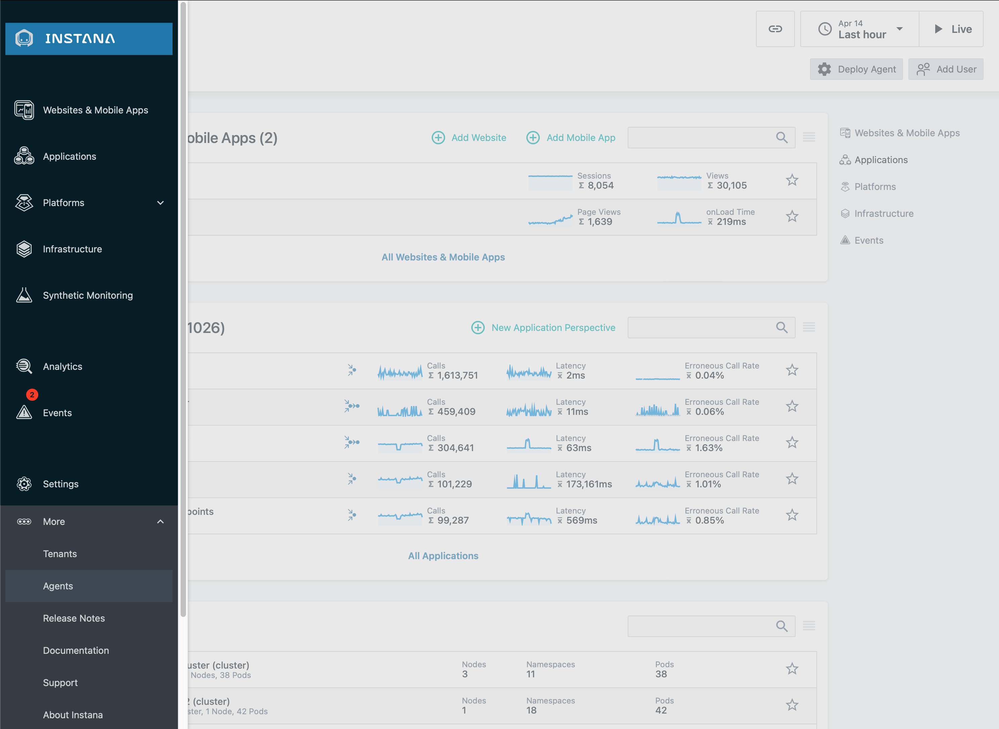
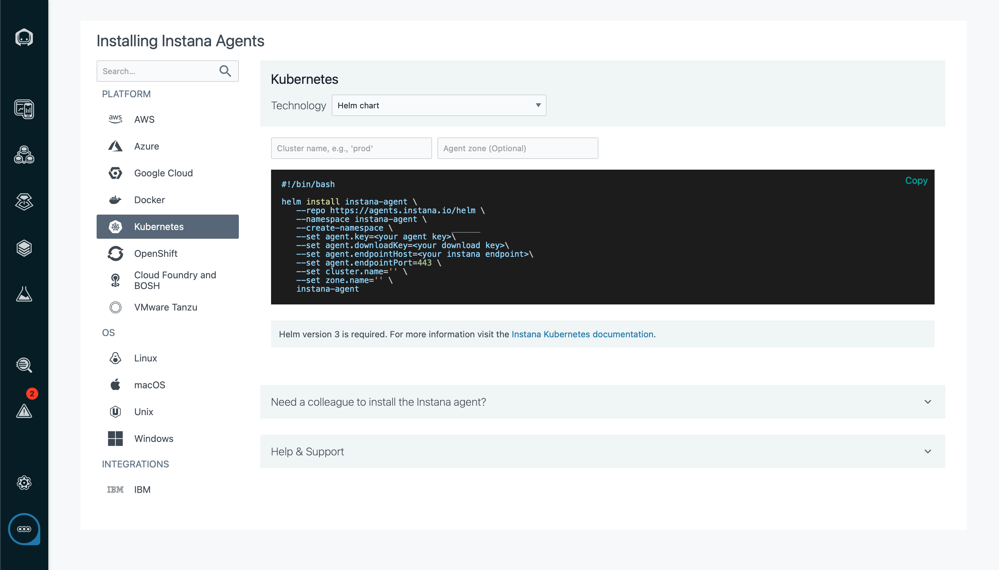

# Instana Kubernetes Quickstart w/ Helm (WIP)

## Who this guide is for
This guide will get you started with Instana on Kubernetes quickly. For production deployments you should read the [complete documentation](https://www.ibm.com/docs/en/instana-observability/current?topic=instana-monitoring-kubernetes) carefully and be aware of special cases that may apply to your specific Kubernetes environment.

## Prerequisites
You will need access to a Kubernetes cluster (minimum version 1.21) with `kubectl` and `helm` (v3) configured on your local machine.

## Step 1: Install the agent

1. Log in to your Instana account and choose "Agents" from the "More" menu:


2. Choose "Kubernetes" from the list of available platforms and then choose "Helm" from the installation methods:


> **Note**
> While this  quickstart guide uses helm, we recommend using the [Instana Operator](https://www.ibm.com/docs/en/instana-observability/current?topic=requirements-installing-host-agent-kubernetes#install-by-using-the-operator) for production deployments.

## Step 2: Configure Monitored Applications
The AutoTrace WebHook can instrument many of your applications. For other applications, you will simply need to install a single Instana instrumentation library and initialize it. See a [complete list of language support here](../languages.md).

The instrumentation for some languages [needs to know how to communicate with the agent](https://www.ibm.com/docs/en/instana-observability/current?topic=technologies-monitoring-postgresql). This step is required for the following languages:

* Node.js
* Go
* Ruby
* Python
* .NET Core

Add the following snippet to your pod deployment definitions:

```yaml
spec:
  containers:
    env:
      - name: INSTANA_AGENT_HOST
        valueFrom:
          fieldRef:
            fieldPath: status.hostIP
```

> **Note**
> You can see an [example of this](https://github.com/instana/robot-shop/blob/55292e2199f2fb00a165b1f7d3045fe7f8922038/K8s/helm/templates/catalogue-deployment.yaml#L24) in the Robot Shop application helm chart.

## Step 3: Configure Supported Technologies
Once the agent is installed and your applications are instrumented, any upstream or downstream services such as databases and messaging queues will be automatically discovered by the agent. For some technologies, specific configuration allows the Instana agent to collect additional data. You can check the list of supported technologies for any additional configuration steps based on the technologies that you have in use.

A very common configuration step is providing database credentials to the agent. For example, when monitoring [PostgreSQL](https://www.ibm.com/docs/en/instana-observability/current?topic=technologies-monitoring-postgresql) the agent needs `SELECT` permissions on the `pg_stat_database` database.

We can provide this configuration with the following helm command:

```sh
helm upgrade instana-agent \
--namespace instana-agent \
--reuse-values \
--repo https://agents.instana.io/helm \
--set configuration.yaml |
  com.instana.plugin.postgresql:
    user: '<USERNAME>'
    password: '<PASSWORD>'
    database: '' # by default PostgreSQL will use 'user' as database to connect to.
```

> **Warning**
> You will need to restart the agent pods after updating configuration.

## Using the Helm Chart Values
The [helm chart](https://github.com/instana/helm-charts/tree/main/instana-agent#configuration-reference) provides a number of helpful values for commonly used configuration options. A common option is to enable the agent service which is a prerequisite for Prometheus, OpenTelemetry, and other agent APIs:

```bash
helm upgrade instana-agent \
--namespace instana-agent \
--reuse-values \
--set service.create=true \
--repo https://agents.instana.io/helm \
instana-agent
```

> **Note**
> We use the helm `--reuse-values` flag so that we don’t need to provide our API key or existing configuration when adding new configuration.  

## Enable OpenTelemetry Support (Optional)
The Instana agent can ingest metrics, traces, and logs* in OTLP format. This can be enabled for http, grpc, or both:

```bash
helm upgrade instana-agent \
--namespace instana-agent \
--reuse-values \
--set opentelemetry.grpc.enabled=true \
--set opentelemetry.http.enabled=true \
--repo https://agents.instana.io/helm \
instana-agent
```

### Configuring OpenTelemetry Services
Applications instrumented with OpenTelemetry need to be configured to send their telemetry to the Instana Agent’s endpoints.

```yaml
spec:
  containers:
    env:
      - name: OTLP_TRACES_ENDPOINT
        valueFrom:
          fieldRef:
            fieldPath: status.hostIP
```

## Enable AutoTrace (Optional)
The Instana AutoTrace WebHook can automatically install instrumentation for Node.js, .NET Core, Ruby, and Python applications running in your cluster. For more information, see the complete AutoTrace documentation.

AutoTrace should not be used with applications that are instrumented with OpenTelemetry or other non-Instana instrumentation.

```bash
helm install --create-namespace --namespace instana-autotrace-webhook instana-autotrace-webhook \
  --repo https://agents.instana.io/helm instana-autotrace-webhook \
  --set webhook.imagePullCredentials.password=<download_key>
```

> **Note**
> You will need to replace `<download_key>` with your Instana API key.
